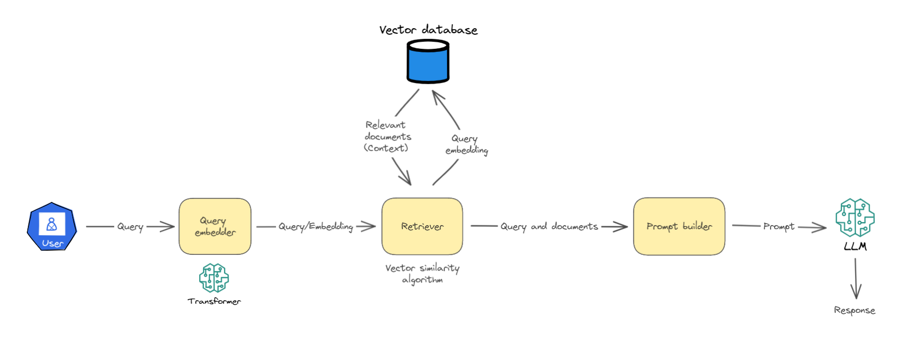
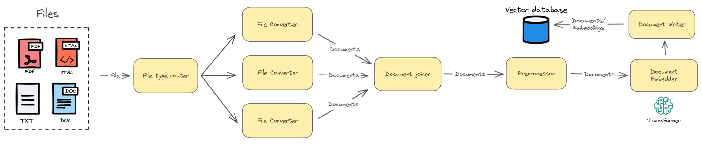

# LLM-APP
LLM-based applications using [Haystack 2.x](https://docs.haystack.deepset.ai/docs/intro)

## RAG
The notebooks `rag_mlflow_documents.ipynb` and `rag_arbitrary_sources.ipynb` demonstrate how to use Haystack and MLflow to create and evaluate a RAG pipeline with various metrics. If you're unfamiliar with RAG, the diagrams below provide a high-level overview of the process.



### Starting a Local MLflow Server

Before running the Jupyter notebooks, make sure to start a local MLflow server. This is crucial for logging and tracking experiments within the RAG pipeline.

To start a local MLflow server, run the following command in your terminal:

```bash
mlflow server --host 127.0.0.1 --port 8080
```
### Using Hugging Face Transformers in RAG Pipeline

For optimal performance in the RAG pipeline, it is recommended to use a GPU for running Hugging Face transformers. Utilizing a GPU can significantly speed up model inference.

### What to Do If You Don’t Have a GPU

If you do not have access to a GPU-enabled VM or machine, you can still run the pipeline on a CPU. To adjust the settings for CPU usage, please refer to the comments in the Jupyter notebooks.

Ensure to modify the `device` parameter in the model loading commands to `"cpu"` if a GPU is not available.
